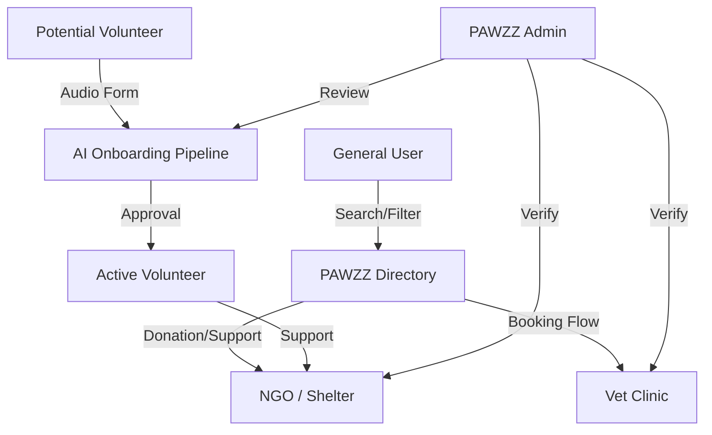
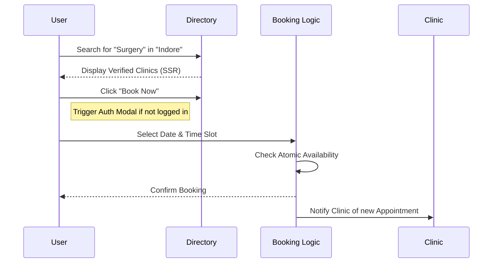

# 🐾 PAWZZ | Core Concept & Product Vision
> **Connecting Pet Care, Together.**

## 1. Executive Summary
PAWZZ is a transformative digital ecosystem designed to unify the fragmented landscape of pet care. By bridging the gap between veterinary clinics, non-governmental organizations (NGOs), independent service providers, and a passionate community of volunteers, PAWZZ creates a seamless, trustworthy, and modern infrastructure for animal welfare. Built on the principles of transparency and community-first interaction, the platform serves as a single source of truth for pet health services and advocacy.

### One-Line Product Definition
**PAWZZ is the unified digital bridge connecting those who provide pet care with the community that loves and advocates for them.**

---

## 2. Mission & Vision
### Our Mission
To democratize access to high-quality pet care and advocacy by providing a secure, transparent, and efficient platform that empowers professionals, NGOs, and volunteers to collaborate effectively.

### Our Vision
To become the global standard for pet care connectivity, where every animal has immediate access to assistance and every care provider has the digital tools necessary to thrive in a modern, automated, and community-driven environment.

---

## 3. The Problem Statement
The current pet care industry suffers from extreme fragmentation. Information is siloed, trust is difficult to verify, and the logistics of booking or volunteering are often handled through antiquated, unreliable channels.

| Fragmented State (Current) | The PAWZZ Solution |
| :--- | :--- |
| **Siloed Information**: Users must search multiple social media groups and websites to find reliable clinics or NGOs. | **Unified Directory**: A single, SEO-optimized source of truth for all verified pet care providers. |
| **Manual Bookings**: Appointments are made via phone calls or unmanaged messages, leading to double bookings. | **Atomic Booking System**: A high-concurrency, secure digital booking engine with real-time availability. |
| **High Friction Volunteering**: Onboarding volunteers is a manual, document-heavy process that deters participation. | **AI-Powered Onboarding**: Streamlined volunteer applications with custom audio transcription and automated workflows. |
| **Lack of Trust**: NGOs and clinics are often unverified, making it difficult for donors and users to feel secure. | **Strict Moderation**: A rigorous admin-led verification process for all listed entities. |

---

## 4. User Roles & Ecosystem
PAWZZ is designed as a multi-tenant platform with distinct roles, each receiving a tailored experience.

### 👥 The Community
- **General Users**: Pet owners looking for trusted services, clinics, or advice. They seek transparency and ease of use.
- **Volunteers**: Individuals ready to offer their time and skills. They require low-friction onboarding and clear communication.

### 🏥 The Providers
- **Vet Clinics**: Medical professionals seeking to manage their patient flow and reach new clients efficiently.
- **NGOs & Sheters**: Organizations focused on rescue and welfare that need a platform to coordinate help and visibility.
- **Service Providers**: Groomers, trainers, and sitters looking to grow their business through a trusted brand.

### 🛡️ The Orchestrators
- **City Leads**: Decentralized moderators managing specific geographical regions to ensure local relevance.
- **Admins**: Super-users managing system integrity, platform-wide moderation, and dispute resolution.

---

## 5. Product Ecosystem Flow

---

## 6. Core Modules & Functionality
### 🟢 The Directory (Search & Discovery)
The heart of PAWZZ is the SEO-optimized directory. It uses Next.js Server-Side Rendering (SSR) to ensure that clinics and NGOs are indexed by search engines, allowing them to reach users even outside the platform's direct traffic.
- **Visuals**: Rounded cards, soft shadows (#E5E7EB), and a "White Cloud" (#FFF9F4) backdrop.
- **Access Control**: Sensitive data masking for unauthenticated users ensures privacy and incentivizes platform participation.

### 📅 The Atomic Booking Engine
Modern pet care requires precision. Our booking system is built to handle thousands of concurrent users without the risk of double-booking.
- **Workflow**: A 3-step intuitive modal (Date -> Slot -> Confirm).
- **Concurrency**: Backend implementation uses atomic database operations to lock slots the millisecond they are selected.

### 🎙️ The Voice-First Volunteer System
Removing the barrier to entry for volunteers is critical. PAWZZ utilizes an innovative audio-based application system.
- **Experience**: Volunteers record their "Why" directly in the browser.
- **Pipeline**: Audio is stored in MongoDB GridFS and transcribed asynchronously using AI worker threads, allowing admins to review applicants in a fraction of the time.

### 🛡️ The Moderation & Admin Suite
Trust is our primary currency. Every clinic and NGO listing must pass through a strict verification queue.
- **Interfaces**: High-density data tables, side-by-side audio review panels, and instant verification status updates.

---

## 7. UX Philosophy & Visual Identity
PAWZZ is built to feel **Trustworthy, Warm, Modern, and Community-first**.

### Visual Language
- **Palette**: The deep **Teal Ocean** (#0A9396) signifies professional trust, while **Summer Sun** (#EE9B00) highlights add a layer of warmth and positivity.
- **Shapes**: Organic wave SVG blobs and paw-print watermarks create a soft, non-intimidating environment.
- **Surfaces**: Every interactive element uses a `rounded-2xl` or `rounded-xl` border-radius to maintain a friendly, approachable aesthetic.
- **Responsive Nature**: From the search bar to the booking calendar, every component is developed for a "Mobile-First" experience, ensuring accessibility for users on the go.

---

## 8. User Journey: Finding and Booking a Vet

---

## 9. Why PAWZZ Matters
In the current digital age, pet care is often treated as a commodity or a secondary concern. PAWZZ elevates animal welfare to a priority by providing professional-grade tools to those who need them most. We believe that by connecting care providers more efficiently, we directly impact the quality of life for millions of pets.

### Success Criteria
1. **Network Growth**: Number of verified NGOs and Clinics joining the platform month-over-month.
2. **Onboarding Efficiency**: Reducing volunteer application time through voice-to-text automation.
3. **Booking Reliability**: Zero instances of double-booking due to our atomic concurrency engine.
4. **Community Trust**: High engagement rates with verified provider listings.

---

## 10. Conclusion
PAWZZ isn't just a directory; it's a movement toward a more connected and compassionate pet care landscape. By combining cutting-edge technology like AI transcription and atomic database operations with a warm, modern aesthetic, we are setting a new standard for how communities care for their animals.

**PAWZZ: Connecting Pet Care, Together.**
