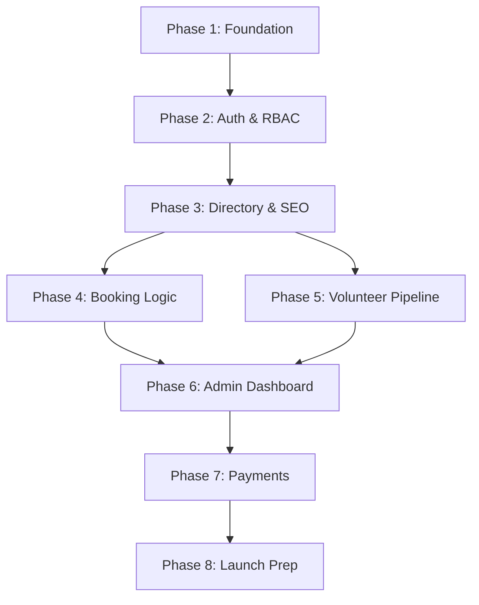

# 🗺️ PAWZZ | Plan of Action & Execution Roadmap
> **The Path to Connecting Pet Care, Together.**

## 1. Build Strategy & Approach
The PAWZZ development strategy is focused on **speed-to-market** without compromising on **technical integrity**. We adopt an incremental development model where core infrastructure (Auth and Data) is established first, followed by specialized modules (Booking, Volunteer Pipelines).

### Core Principles
- **Agile Sprints**: 2-week development cycles ending in a demo.
- **Fail-Safe Booking**: Prioritize atomic operations above all else.
- **Micro-Interactions**: Implement design language (animations/feedback) early to maintain brand trust.

---

## 2. Phased Implementation Roadmap

### 🗓️ Phase 1: Design System & Base Layout
- **Objective**: Establish the visual identity and core UI components.
- **Tasks**:
  - Setup Tailwind config with exact hex values (#005F73, #0A9396, #EE9B00, #FFF9F4).
  - Implement **Plus Jakarta Sans** and global typography scale.
  - Build atomic components: Primary Button, Rounded Cards, Modal Backdrop.
- **Done Criteria**: A shared component library capable of rendering the Hero section.

### 🔐 Phase 2: Project Setup & Auth (RBAC)
- **Objective**: Secure the platform and handle user sessions.
- **Tasks**:
  - Initialize Next.js App Router and Express Backend.
  - Setup MongoDB Atlas connection with Mongoose.
  - Implement Google OAuth login and HttpOnly JWT cookies.
- **Done Criteria**: Users can log in and session is persisted across routes.

### 📂 Phase 3: Directory & Listings (SSR)
- **Objective**: Create the searchable, SEO-friendly directory.
- **Tasks**:
  - Build Listing Schema and CRUD operations.
  - Implement Next.js SSR for pre-rendering public listings.
  - Add search and category filters with GeoJSON indexing.
- **Done Criteria**: Publicly searchable listing pages with data masking active.

### 📅 Phase 4: Atomic Booking Workflow
- **Objective**: Implement the fault-tolerant booking system.
- **Tasks**:
  - Build the 3-step Booking Modal (Calendar -> Slots -> Summary).
  - Implement `findOneAndUpdate` atomic locking in the backend.
  - Setup conflict handling UI (shake animation + grid refresh).
- **Done Criteria**: Multiple users can attempt simultaneous booking with zero double-bookings.

### 🎙️ Phase 5: Volunteer Pipeline & Media
- **Objective**: Audio application and AI transcription.
- **Tasks**:
  - Build browser-based recording UI with `MediaRecorder API`.
  - Setup GridFS for storage and Worker Thread for Whisper transcription.
  - Implement application status tracking for volunteers.
- **Done Criteria**: Audio file uploaded, stored, and transcribed in the background.

### 🛡️ Phase 6: Admin Dashboard & Moderation
- **Goal**: Provide tools for listing and volunteer verification.
- **Tasks**:
  - Build sidebar-nav dashboard for Roles: Admin, City Lead.
  - Implement high-density tables for moderation queues.
- **Done Criteria**: Admin can view transcripts, listen to audio, and verify listings.

### 💰 Phase 7: Payments & Webhook Verification
- **Goal**: Process transactions for paid services.
- **Tasks**:
  - Integrate Razorpay bridge on the frontend.
  - Setup secure HMAC SHA256 webhook verification.
- **Done Criteria**: Bookings confirmed only after verified payment receipt.

---

## 3. Development & Launch Checklists

### ✅ Development Checklist
- [ ] Zod schema validation on ALL API inputs.
- [ ] Responsive design verified for Mobile, Tablet, and Desktop.
- [ ] Error boundary handling in Next.js for all page transitions.
- [ ] SEO Meta-tags (OpenGraph/Twitter) dynamic for every listing.

### 🧪 QA & Testing Priorities
- **Concurrency Test**: Simulate 100 simultaneous requests on 1 booking slot.
- **Media Test**: Verify audio recording across Chrome, Safari, and Mobile.
- **Auth Test**: Ensure `requireRole` middleware prevents unauthorized dashboard access.

### 🚀 Final Launch Readiness
| Task | Owner | Priority |
| :--- | :--- | :--- |
| **Final Security Audit** | Security Lead | Critical |
| **API Rate Limiting Check** | DevOps | High |
| **Razorpay Production Keys** | Admin | Critical |
| **Lighthouse Performance Scan** | Frontend Lead | Medium |

---

## 4. Risks & Mitigations
- **Risk**: Whisper API latency during peak volunteer applications.
  - **Mitigation**: Use Worker Threads and keep the status as "Processing" to avoid blocking the user.
- **Risk**: Razorpay webhook failure due to network issues.
  - **Mitigation**: Implement idempotency and a "Check Status" fallback route for users.

---

## 5. Maintenance & Future Expansion
- **Phase 9+**: AI Chatbots for initial pet care advice.
- **Phase 10+**: Integrated Pet Health Records (Digital Passports).
- **Phase 11+**: Multi-city localized community events module.

**PAWZZ: Built for reliability, scaled for compassion.**
