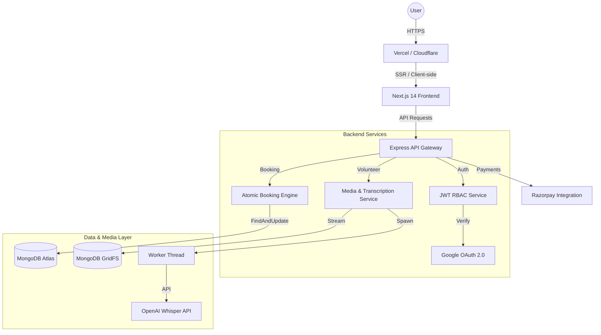
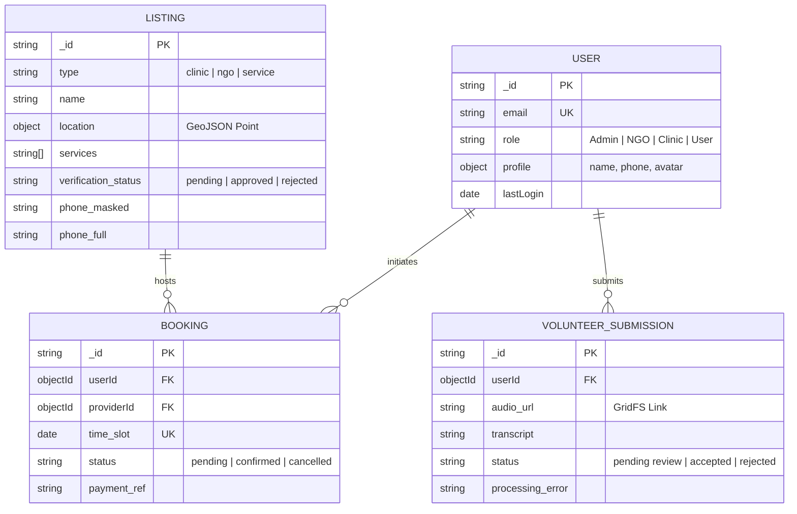
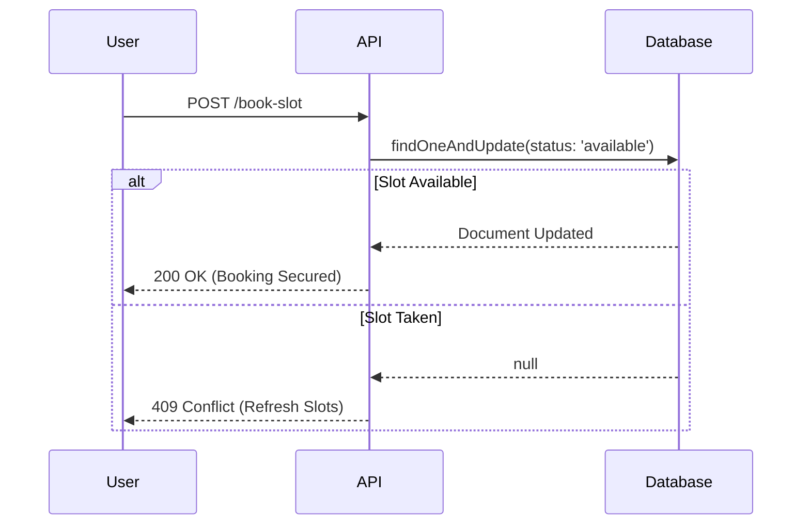
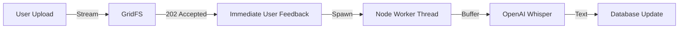

# 🏗️ PAWZZ | Technical Architecture & System Design
> **The Blueprint for a Scalable, Secure Pet Care Ecosystem.**

## 1. Architecture Overview
The PAWZZ platform is architected as a modern, decoupled system optimized for high-concurrency booking, real-time audio processing, and SEO-critical data discovery. We leverage a **Next.js 14 App Router** frontend for exceptional performance and SSR, paired with a robust **Node.js/Express** backend for complex business logic and background processing.



---

## 2. Recommended Technology Stack
| Layer | Technology | Rationale |
| :--- | :--- | :--- |
| **Frontend Framework** | Next.js 14 (App Router) | Best-in-class SEO, performance, and developer experience. |
| **Styling** | Tailwind CSS | Rapid UI development with strict adherence to brand guidelines. |
| **Typography** | Plus Jakarta Sans | Modern, approachable font via `next/font/google`. |
| **Backend Framework** | Express.js | Lightweight and flexible for high-performance API services. |
| **Database** | MongoDB Atlas | Document-driven flexibility for pet care listings and metadata. |
| **ORM/ODM** | Mongoose | Strict schema enforcement and powerful middleware. |
| **Authentication** | Google OAuth 2.0 + JWT | Seamless, secure user onboarding without password fatigue. |
| **File Storage** | MongoDB GridFS | Integrated storage for raw audio blobs without external S3 latency. |
| **AI Transcription** | OpenAI Whisper | Industry-leading accuracy for multi-lingual volunteer audio. |
| **Payments** | Razorpay | Robust checkout and webhook infrastructure for the Indian market. |

---

## 3. Data Model & ER Diagram
All models implementation include `timestamps: true` for audit trails and indexing on critical query fields.



---

## 4. Implementation Deep-Dives

### 🛡️ Authentication & Authorization (RBAC)
We utilize a combination of **Google OAuth 2.0** for identity verification and **JWT (JSON Web Tokens)** for session persistence.
- **Secure Sessions**: JWTs are stored in **HttpOnly, Secure, SameSite=Strict cookies** to mitigate XSS and CSRF risks.
- **RBAC Middleware**: A central `requireRole` middleware checks the decoded token payload against the resource's required permissions before allowing the request to hit the controller.

### 📅 Atomic Booking Concurrency
To handle an initial load of 10,000 users, PAWZZ prevents double-booking through atomic database operations rather than application-side logic.
- **The Flow**:
  1. Frontend fetches availability from a deterministic slots table.
  2. User selects a slot.
  3. Backend executes `findOneAndUpdate({ slot, status: 'available' }, { status: 'locked', userId })`.
  4. If the write returns `null`, the slot was taken milliseconds prior.



### 🎙️ Volunteer Audio Pipeline (GridFS + Workers)
Audio applications are processed asynchronously to avoid blocking the main event loop.
- **Storage**: Raw audio blobs are streamed directly into **MongoDB GridFS** via `multer-gridfs-storage`.
- **Worker Threads**: The server spawns a native Node.js worker thread to pull the audio, send it to the Whisper API, and update the transcription field in the background.



### 💰 Payment & Webhook Verification
Payment integrity is maintained through server-side signature verification.
- **Workflow**: Razorpay Checkout modal handles primary interaction.
- **Integrity**: The backend listens to a restricted webhook. Every payload is verified using **HMAC SHA256** with the Razorpay Secret before the booking status is updated to `confirmed`.

---

## 5. Security & Availability Architecture
- **API Security**: Implementation of `helmet` for secure headers, `cors` configured to specific origins, and `express-rate-limit` to prevent brute-force attacks.
- **Data Masking**: SSR logic in Next.js renders blurred or placeholder data for unauthenticated users, protecting provider privacy.
- **Validation**: Strict schema validation using **Zod** on both frontend and backend ensures data integrity.

---

## 6. Deployment & Scaling
### Environment Strategy
- **Production**: Vercel (Frontend) + Render/AWS (Backend) + MongoDB Atlas.
- **Scaling**: Horizontal scaling of the Express backend behind a load balancer; MongoDB Atlas auto-scaling for the storage layer.

### Recommended Folder Structure
```text
/pawzz
  /frontend
    /app           # Next.js App Router
    /components    # UI Design System
    /context       # Auth state
    /services      # API wrappers
  /backend
    /controllers   # Request handling
    /models        # Mongoose schemas
    /middlewares   # RBAC & Headers
    /workers       # Transcription threads
    /utils         # JWT & Constants
```

---

## 7. Performance Goals
- **API Latency**: <200ms for indexed read queries.
- **SEO Score**: >90 Lighthouse performance for directory pages.
- **Uptime**: 99.9% availability for the booking engine.

**PAWZZ is engineered for trust, scale, and connectivity.**
 Riverside Building, Indore, India.
