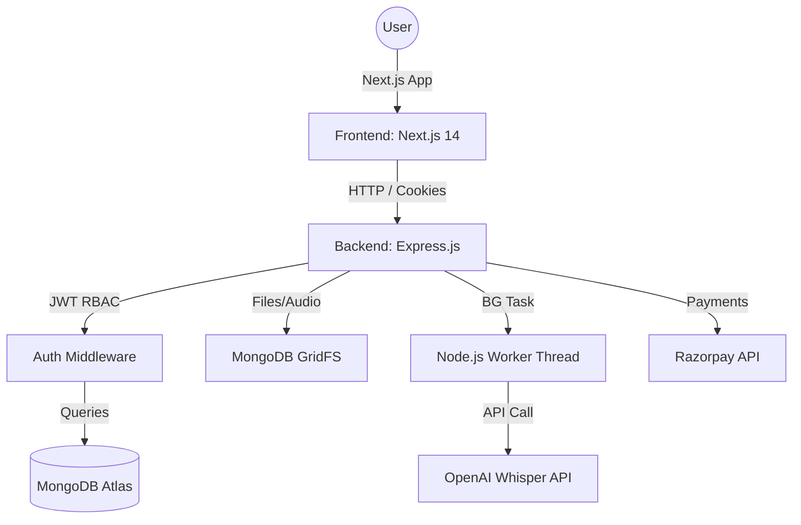
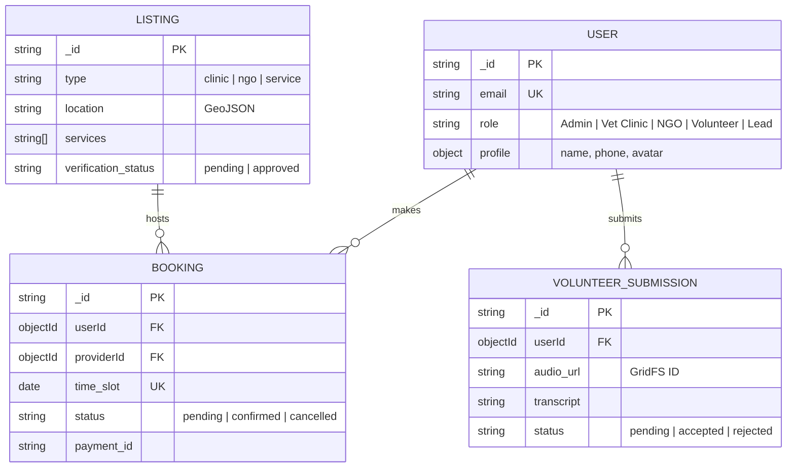

# 🏗️ PAWZZ | Technical Architecture & System Design

## 1. High-Level Architecture
PAWZZ is built as a decoupled but highly integrated system using the **Next.js App Router** for the frontend and an **Express.js** backend. This ensures SEO excellence for directory listings while maintaining high-performance event loops for heavy logic (audio processing, atomic bookings).



---

## 2. Entity Relationship Diagram (ERD)
The database schema is optimized for relational integrity within MongoDB using Mongoose.



---

## 3. Directory Structure (Full Blueprint)
```text
/pawzz
├── /frontend (Next.js)
│   ├── /app
│   │   ├── /api/auth    # Client-side auth handlers
│   │   ├── /directory   # SEO Optimized SSR Listing pages
│   │   ├── /booking     # Interactive calendar flows
│   │   ├── /admin       # Moderation Dashboard
│   │   └── /volunteer   # Audio recording & form logic
│   ├── /components
│   │   ├── /ui          # Atomic: Buttons, Inputs, Badges
│   │   ├── /forms       # Complex: BookingForm, VolunteerForm
│   │   ├── /modals      # AuthModal, BookingModal
│   │   └── /layout      # Navbar, Sidebar, Footer
│   ├── /hooks           # useAuth, useMediaRecorder
│   ├── /services        # Axios/Fetch wrappers for API
│   └── /lib             # Tailwind utils, Zod schemas
├── /backend (Express)
│   ├── /config          # Database, Passport, GridFS
│   ├── /controllers     # Booking, Auth, Volunteer, Listing
│   ├── /middlewares     # authHandler, roleGuard, errorHandler
│   ├── /models          # Mongoose Schemas (User, Listing, etc)
│   ├── /routes          # API definition
│   ├── /services        # Razorpay, Mailer, GridFS stream
│   ├── /workers         # Whisper AI Translation Threads
│   └── /validators      # Zod/Joi API validation
└── .env                 # Secrets & Config
```

---

## 4. Deep Technical Implementations

### A. Atomic Booking Logic (Anti-Double Booking)
To handle 10k users, we use MongoDB's `findOneAndUpdate` with a condition for concurrency control.
```javascript
// Example implementation in BookingController
const result = await Availability.findOneAndUpdate(
  { providerId: providerId, slot: time_slot, status: 'available' },
  { $set: { status: 'locked', userId: userId } },
  { new: true }
);
if (!result) throw new Error('SLOT_OCCUPIED'); // 409 Conflict
```

### B. Volunteer Audio Pipeline (GridFS + Worker)
1.  **Frontend**: Captures audio via `MediaRecorder API` -> sends Blob to `/api/volunteer`.
2.  **Backend**: `Multer-GridFS` streams blob directly to MongoDB.
3.  **Worker**: Spawns a background thread to process Whisper API.
    *   *Why?* To prevent Whisper's 10s latency from blocking the Express event loop.

### C. Data Masking for SEO
- **Public Results**: `/api/listings` returns sanitized objects (Phone/Address omitted).
- **Private Results**: `/api/listings/:id` requires `JWT` to reveal sensitive fields.
- **SSR Benefit**: Next.js pre-renders the name/location for Google bots while keeping private contact details hidden until client-side auth.

### D. Secure Webhooks
Razorpay webhooks use `crypto.createHmac('sha256', secret)` to verify the signature header before updating booking status to `confirmed`.
