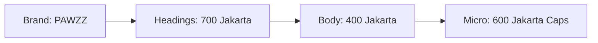

# 🐾 PAWZZ | Brand Identity & UI System
> **Connecting Pet Care, Together.**

## 💎 Brand Personality
`Trustworthy` · `Warm` · `Modern` · `Community-first`

---

## 🎨 Color Palette
The PAWZZ palette is inspired by the warmth of the sun and the serenity of the ocean, creating a balance of professional trust and welcoming energy.

### Core Brand Colors
| Role | Color | Hex | Sample |
| :--- | :--- | :--- | :--- |
| **Primary Dark** | Sky Blue | `#005F73` | 🔵 |
| **Primary Action** | Teal Ocean | `#0A9396` | 🌊 |
| **Hover Accents** | Summer Sun | `#EE9B00` | ☀️ |
| **Global Background** | White Cloud | `#FFF9F4` | ☁️ |

### Semantic & Surface
| Role | Hex | Color |
| :--- | :--- | :--- |
| **Success** | `#10B981` | 🟢 Success |
| **Error** | `#EF4444` | 🔴 Error |
| **Info** | `#3B82F6` | 🔵 Info |
| **Headings** | `#0D2B2E` | Deep Teal |
| **Body Text** | `#4B5563` | Slate Gray |
| **Surface (Cards)** | `#FFFFFF` | Pure White |
| **Borders** | `#E5E7EB` | Soft Gray |

---

## 🖋️ Typography
We use **Plus Jakarta Sans** via `next/font/google` for a modern, approachable feel.

### Type Scale
- **H1**: `36px` | 800 Weight | `PAWZZ` Wordmark
- **H2**: `24px` | 700 Weight | Section Headings
- **H3**: `20px` | 700 Weight | Component Headings
- **Body**: `16px` | 400 Weight | Standard Text
- **Labels**: `14px` | 500 Weight | Captions/Tags
- **Badges**: `12px` | 600 Weight | Mini Tags

---

## 🧱 Visual Language
### Surfaces & Shapes
- **Global BG**: `#FFF9F4` (White Cloud) - *Never Neutral Gray*.
- **Cards**: `#FFFFFF`, `rounded-2xl`, `shadow-sm`, `border-[#E5E7EB]`.
- **Interactions**: On hover, cards transition with `translateY(-2px)` and `shadow-xl`.
- **Aesthetics**: Large organic blobs in teal (`#0A9396`) at 10% opacity; subtle paw print watermarks at 6% opacity.

### Border Radius System
- **Buttons**: `rounded-xl`
- **Cards**: `rounded-2xl`
- **Inputs**: `rounded-lg`
- **Badges**: `rounded-full`

---

## 🧭 Main Navigation
### Desktop Navbar
- **Height**: `16` (64px) | `fixed top-0` | `backdrop-blur-md`
- **Left**: `PAWZZ` wordmark + Teal Paw Icon.
- **Center**: Directory · Volunteer · Booking (Hover: `#0A9396`).
- **Active State**: `#005F73` Text + `#EE9B00` Bottom Border (2px).
- **Right**: "Login with Google" (Teal Outline) or User Avatar (2px Teal Border).

### Mobile Navigation
- **Trigger**: Hamburger Icon.
- **Drawer**: Slide-in from right, `bg-[#005F73]`, text-white.

---

## 🔘 Button Components
| Variant | Style | Interaction |
| :--- | :--- | :--- |
| **Primary** | `bg-[#0A9396]` | Hover: `#005F73`, Scale-95 |
| **Secondary** | `border-2 border-[#0A9396]` | Hover: Teal Tint BG |
| **Accent (CTA)** | `bg-[#EE9B00]` | Hover: Darker Amber, Shadow-lg |
| **Danger** | `bg-red-500` | Hover: `bg-red-600` |
| **Disabled** | `opacity-50` | `pointer-events-none` |

---

## 📅 Functional UI Modules

### 1. Directory Listing
- **Grid**: Responsive 1 col (mobile) to 3 cols (desktop).
- **Listing Card**: White surface, 2xl radius.
- **Data Protection**: Unauthenticated users see `blur-sm grayscale` with a "Login to view" overlay chip.

### 2. Booking System
- **Calendar**: `rounded-2xl` bg-white.
- **Time Slots**: Grid of 3.
  - *Available*: Teal border, hover teal tint.
  - *Selected*: Teal background, white text.
  - *Booked*: Gray background, line-through.

### 3. Auth Modal
- **Overlay**: `bg-black/40` + `backdrop-blur-sm`.
- **Card**: Max-width `md`, centered PAWZZ logo.
- **Role Selector**: Custom styled radio groups with icons for NGO, Clinic, and Volunteer roles.

---

## ✨ Micro-interactions & Animations
- **Spring Effects**: All button presses use `scale(0.97)` for tactile feedback.
- **Modal Entrance**: `opacity-0` to `opacity-1` + `translateY(12px)` to `0`.
- **Loading States**: Replicate card shapes using `bg-[#EEF9F9]` animate-pulse blocks (Skeletons).
- **Toasts**: Slide-in from bottom-right, auto-dismiss in 4 seconds.
- **Conflict Handling**: Time grid shakes and flashes red on double-booking detection.

---

## 🚨 Error & Empty States
- **Empty Directory**: Centered illustration of a sad paw + "No listings found".
- **Forbidden**: Never a raw 403; always triggers the Auth Modal overlay.
